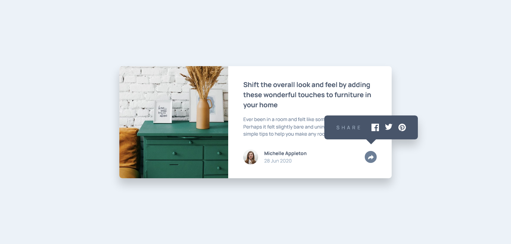

# Frontend Mentor - Article preview component solution

This is a solution to the [Article preview component challenge on Frontend Mentor](https://www.frontendmentor.io/challenges/article-preview-component-dYBN_pYFT). Frontend Mentor challenges help you improve your coding skills by building realistic projects.

## Table of contents

- [Overview](#overview)
  - [The challenge](#the-challenge)
  - [Screenshot](#screenshot)
  - [Links](#links)
- [My process](#my-process)
  - [Built with](#built-with)
  - [What I learned](#what-i-learned)
  - [Continued development](#continued-development)
  - [Useful resources](#useful-resources)
- [Author](#author)
- [Acknowledgments](#acknowledgments)

## Overview

### The challenge

Users should be able to:

- View the optimal layout for the component depending on their device's screen size
- See the social media share links when they click the share icon

### Screenshot



### Links

- Solution URL: [source code](https://github.com/codexshell/article-preview-component)
- Live Site URL: [website](https://article-preview-component-7tlc7lwcz-codexshell.vercel.app/)

## My process

### Built with

- Semantic HTML5 markup
- Flexbox
- CSS Grid
- Mobile-first workflow
- [BEM](http://getbem.com/) - CSS Methodology
- [CUBE CSS](https://cube.fyi/) - CSS Methodology
- [tailwindcss](https://tailwindcss.com/) - CSS framework
- [SvelteKit](https://kit.svelte.dev/) - Svelte Framework

### What I learned

- Before using the `object-fit` CSS property one must explicity specify an intial width and height for the `img` element.
- This can be demonstrated as below:

```css
img {
	width: 100%;
	height: 100%;
	object-fit: cover;
}
```

- `width` and `height` are to be set as per one's requirement.

### Continued development

- [Conventional Commits](https://www.conventionalcommits.org/en/v1.0.0/)

### Useful resources

- [CSS The object-fit Property](https://www.w3schools.com/css/css3_object-fit.asp) - This helped me realize that before using the `object fit` CSS property one has to first explicity set an initial width and height.

## Author

- Website - [Silvanos Eric](https://codexshell.github.io/)
- Frontend Mentor - [@codexshell](https://www.frontendmentor.io/profile/codexshell)
- Twitter - [@codexshell](https://twitter.com/codexshell)
